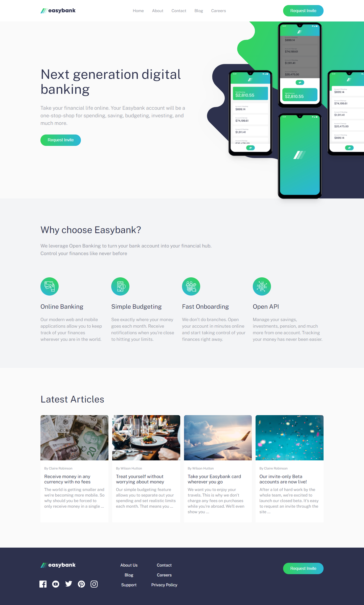

# Frontend Mentor - Easybank landing page solution

This is a solution to the [Easybank landing page challenge on Frontend Mentor](https://www.frontendmentor.io/challenges/easybank-landing-page-WaUhkoDN). Frontend Mentor challenges help you improve your coding skills by building realistic projects.

## Table of contents

-   [Overview](#overview)
    -   [Screenshot](#screenshot)
    -   [Links](#links)
-   [My process](#my-process)
    -   [Built with](#built-with)
    -   [What I learned](#what-i-learned)
-   [Author](#author)

## Overview

### Screenshot



### Links

-   Solution URL: [My Solution URL](https://easybank-page.pages.dev/)
<!-- -   Live Site URL: [Add live site URL here](https://your-live-site-url.com) -->

## My process

### Built with

-   Flexbox
-   CSS Grid
-   Sass - CSS Preprocessor
-   Mobile-first workflow
-   [React](https://reactjs.org/) - JS library

### What I learned

I learned from this project so many things about CSS Grid , CSS Flexbox with Sass and the Mobile-first workflow and these some examples of my working with it :

```scss
.footer__wrapper {
    display: flex;
    flex-direction: column;
    align-items: center;
    @include breakpoint-up(large) {
        padding: 60px 0px 50px;
        display: grid;
        grid-template-columns: repeat(4, 1fr);
        grid-template-areas:
            "topLeft middle . right"
            "bottomLeft  middle . right ";
    }
}
```

## Author

-   Gihub - [@Sami-20s](https://github.com/Sami-20s)
-   Frontend Mentor - [@Sami-20s](https://www.frontendmentor.io/profile/Sami-20s)
-   Facebook - [Sami Nashawi](https://www.facebook.com/Sami.nashawi20)
